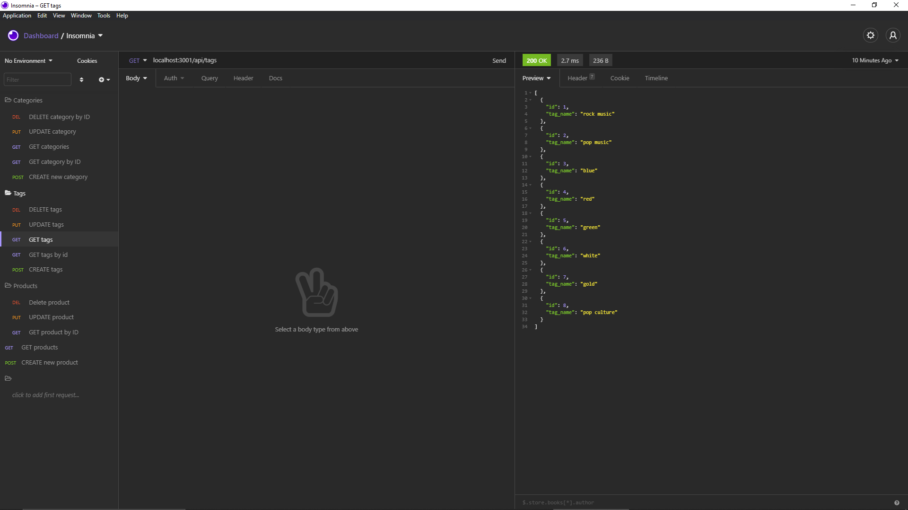

# E-Commerce-Back-End
A backend API e-commerce application 

## Description

The main goal of this project was to create a fully functional backed-end app that is connected to mySQL and is up and running using Insomnia 
 
The User is set up for success from the beginning only having to npm start to start the server up

Once the server is up an running the user has the option to view current products that have been placed in by seeds and ever added products as well

The user can use POST, GET, PUT and DELETE to any product 

All of the product information is stored directly into mySQL where each item is given its own ID

## Installation

GET Categories

GET Products

GET Tags

To check the project, I worked on click on these links: 

GitHub: https://github.com/NBP77/E-Commerce-Back-End

Video link: https://drive.google.com/file/d/18eiekcP6cLQZvYTZN9sjxkpfznV6pZBC/view 

## Usage

Linked up mySQL to store and update data

Models have been created in JS using Sequilize  

Great use of async and await making data entry flow easier 

Up and running POST, GET, PUT and DELETE

.env file installed 

## Credits

I was able to do most of this based of the activities we have done in class.